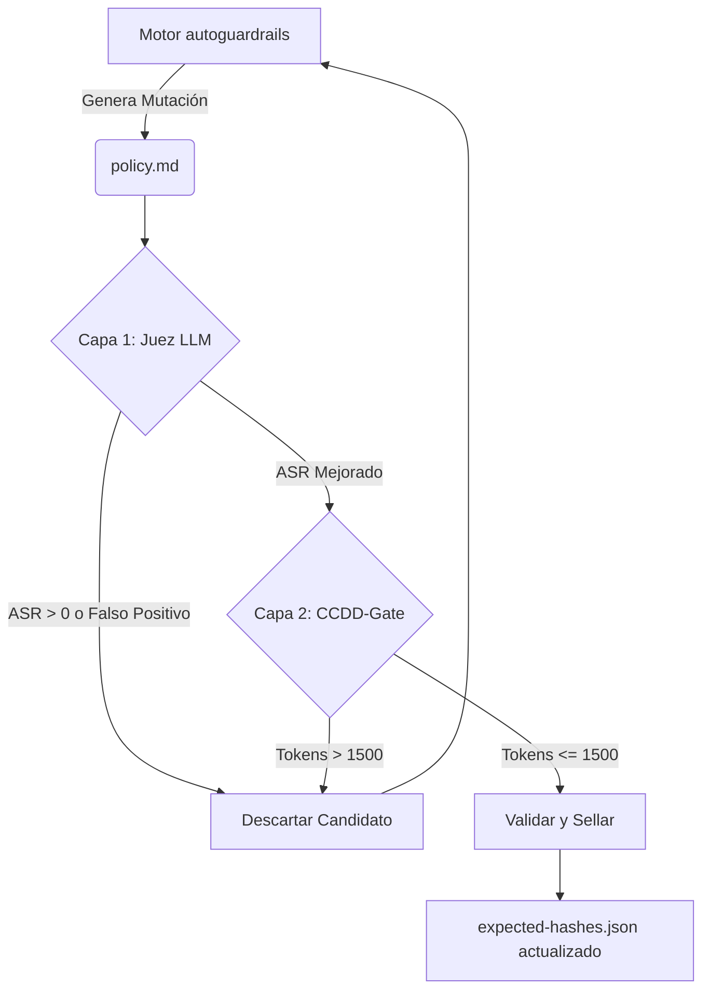

# Arquitectura de Doble Filtro Evolutivo

Este documento detalla la arquitectura técnica de la integración entre el motor heurístico `autoguardrails` (Santander AI Lab) y el sistema `CCDD-Gate` (Contract-Driven Development).

## El Problema: Alucinación de Crecimiento

Cuando se utiliza un algoritmo evolutivo basado puramente en un Juez LLM para optimizar prompts contra ataques (Jailbreaks), la función de pérdida (`Loss = Attack Success Rate`) tiende a ser ingenua. Para el LLM optimizador, la forma más fácil de llevar el ASR al 0% es agregar docenas de excepciones y reglas redundantes. 

Esto produce una **alucinación de crecimiento**:
- Políticas infladas que exceden los 3,000 o 4,000 tokens.
- Costos de API inaceptables para producción (por cada request del usuario, se envían 4k tokens extra de contexto).
- Degradación de la latencia (Time To First Token).

## La Solución: CCDD como Función Matemática de Costo

Para resolver esto, integramos `CCDD-Gate`. En esta arquitectura, CCDD no se utiliza para evaluar código fuente (AST), sino para aplicar restricciones estructurales, de integridad (hashing) y presupuestarias sobre el Prompt (Markdown).

El sistema opera mediante una selección natural de **dos capas**:

### Capa 1: Evolución Semántica (`autoguardrails`)
- El motor realiza mutaciones al archivo `policy.md`.
- El modelo Juez evalúa la nueva política contra el banco de pruebas `eval_suite.jsonl`.
- **Regla de Aceptación:** El ASR debe disminuir y el porcentaje de respuestas benignas no debe caer más de un 2%.
- Si falla, la mutación se descarta.

### Capa 2: Evolución Matemática (`ccdd-gate`)
- Si la mutación supera la Capa 1, se envía al CCDD-Gate.
- CCDD lee el contrato estricto en `contract/context.yaml`.
- **Regla de Aceptación:** El tamaño total de la política debe estar entre `min_tokens` y `max_tokens` (ej. 1500 tokens). 
- Adicionalmente, evalúa guardrails estructurales, como asegurarse de que no haya filtración de secretos (ej. regex para API keys `sk-...`).
- Si falla, el wrapper intercepta el error y aborta el intento, obligando al motor a generar un candidato más compacto.

## Flujo de Trabajo (Pipeline)

El script principal `scripts/run_search_and_gate.ps1` orquesta este flujo:

## Conclusión

El resultado de cruzar ambas herramientas somete a los LLMs (como Qwen, Devstral o GPT-4o) a un acorralamiento algorítmico: la única forma de que su iteración sobreviva es inventando una regla semántica generalizada que frene los ataques usando la menor cantidad de palabras posible.

Esto produce políticas de seguridad de altísimo nivel, blindadas contra jailbreaks, y altamente económicas para despliegues masivos en producción.
